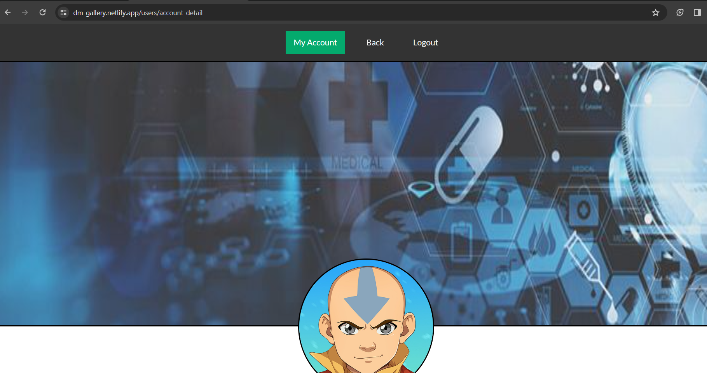

# DM Gallery

A brief description of this project.

## Table of Contents

- [Getting Started](#getting-started)
  - [Prerequisites](#prerequisites)
  - [Installation](#installation)
- [Usage](#usage)
  - [Running the Backend](#running-the-backend)
  - [Running the Frontend](#running-the-frontend)
- [Features](#features)
- [Screenshots](#screenshots)
- [Contributing](#contributing)

## Getting Started

### Prerequisites

- Node.js
- MongoDB

### Installation

1. Clone the repository:

```bash
git clone https://github.com/itsdheerajdp/dm-gallery.git
```

2. Install dependencies:

```bash
cd backend
npm install

cd ../frontend
npm install
```

## Usage

### Running the Backend

1. Make sure MongoDB is running on your machine.
 ```bash
cd backend
npm run dev
```
The server will run on http://localhost:8000


### Running the Frontend

```bash
cd frontend
npm run dev

```
Visit http://127.0.0.1:5173 in your browser to access the frontend.

## Features
- User signup and login.
- Personal gallery for each user.
- Image upload and deletion in the gallery.
- Update user profile details (avatar, cover image, password, full name, email).


## Screenshots
#### *Homepage of the website*


#### *Login page of the website*


#### *Signup page of the website*


#### *User page of the website*


#### *User account details page of the website*


#### *Edit user account page of the website*


## Contributing
Contributions are welcome! Fork the project, make your changes, and submit a pull request.
