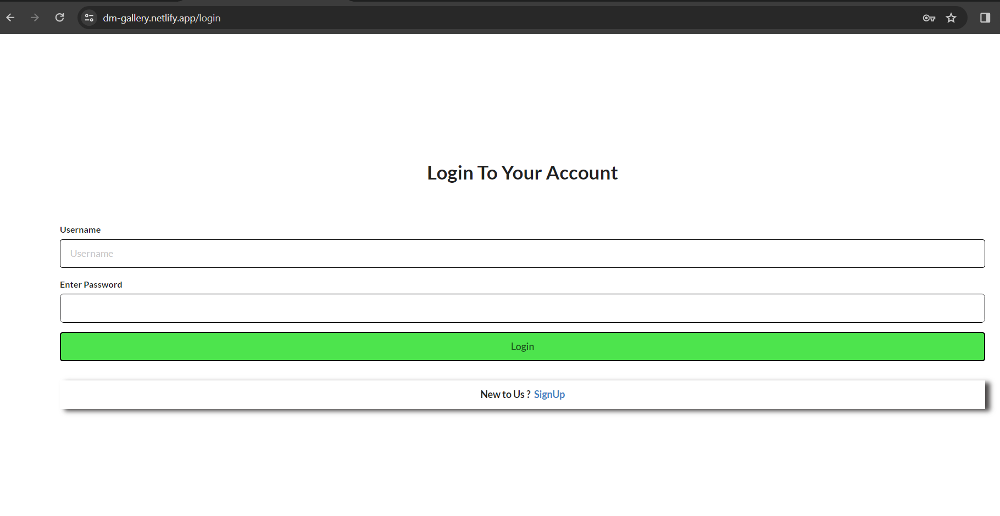
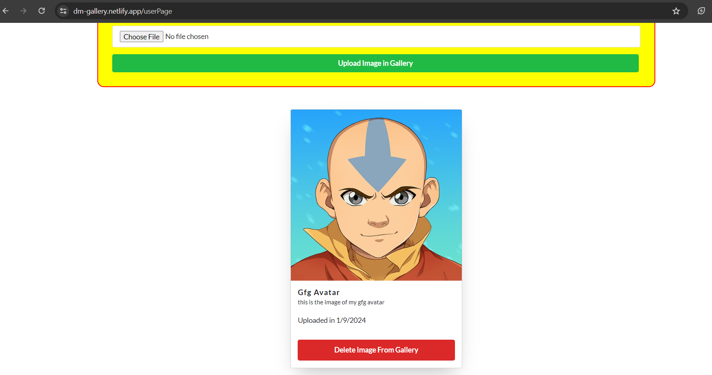
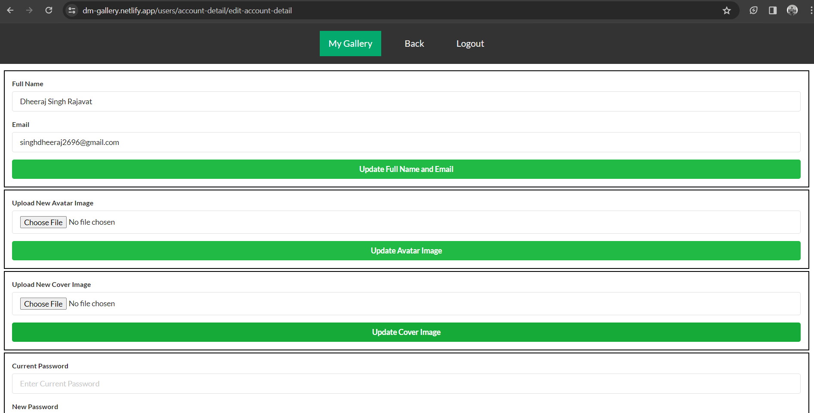

# DM Gallery

Welcome to **DM Gallery** – a platform designed to provide you with a personal space to store and cherish your memories. This website allows you to save and organize your images, creating a gallery that captures the essence of your life's moments. Whether it's a special event, a beautiful scenery, or a candid snapshot, use this space to curate and relive your favorite memories.

Feel the joy of having your own digital gallery, accessible anytime and anywhere. Start exploring the features and make this platform an extension of your life's journey.


## Table of Contents

- [Getting Started](#getting-started)
  - [Prerequisites](#prerequisites)
  - [Installation](#installation)
- [Usage](#usage)
  - [Running the Backend](#running-the-backend)
  - [Running the Frontend](#running-the-frontend)
- [Features](#features)
- [Screenshots](#screenshots)
- [Contributing](#contributing)

## Getting Started

### Prerequisites

- Node.js
- MongoDB

### Installation

1. Clone the repository:

```bash
git clone https://github.com/itsdheerajdp/dm-gallery.git
```

2. Install dependencies:

```bash
cd backend
npm install

cd ../frontend
npm install
```

## Usage

### Running the Backend

1. Make sure MongoDB is running on your machine.
 ```bash
cd backend
npm run dev
```
The server will run on http://localhost:8000


### Running the Frontend

```bash
cd frontend
npm run dev

```
Visit http://127.0.0.1:5173 in your browser to access the frontend.

## Features
- User signup and login.
- Personal gallery for each user.
- Image upload and deletion in the gallery.
- Update user profile details (avatar, cover image, password, full name, email).


## Screenshots
#### *Homepage of the website*


#### *Login page of the website*


#### *Signup page of the website*


#### *User page of the website*



#### *User account details page of the website*


#### *Edit user account page of the website*



## Contributing
Contributions are welcome! Fork the project, make your changes, and submit a pull request.
